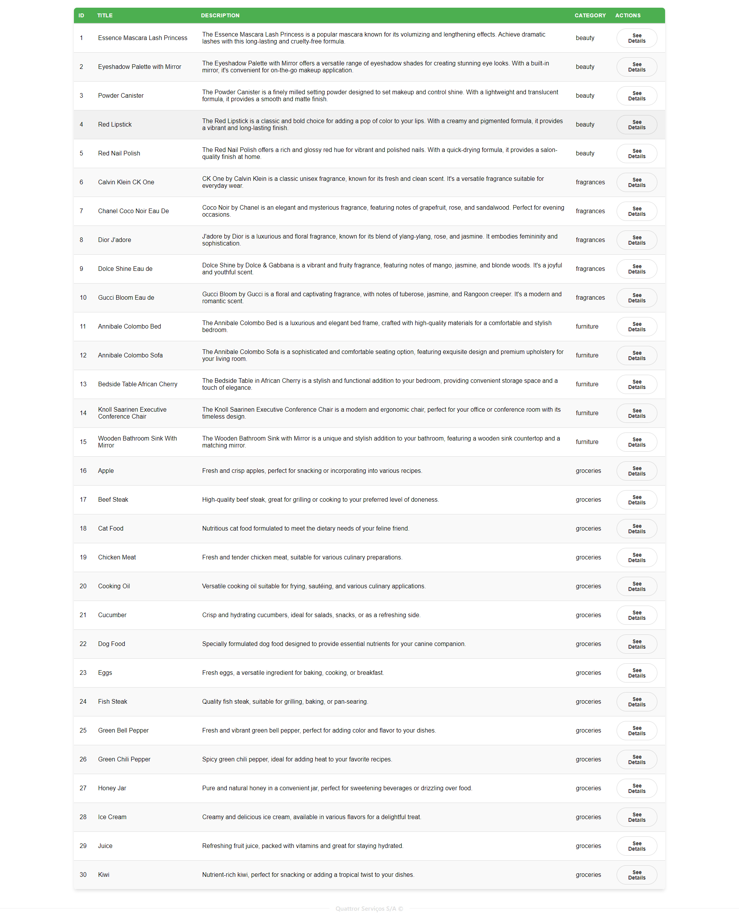
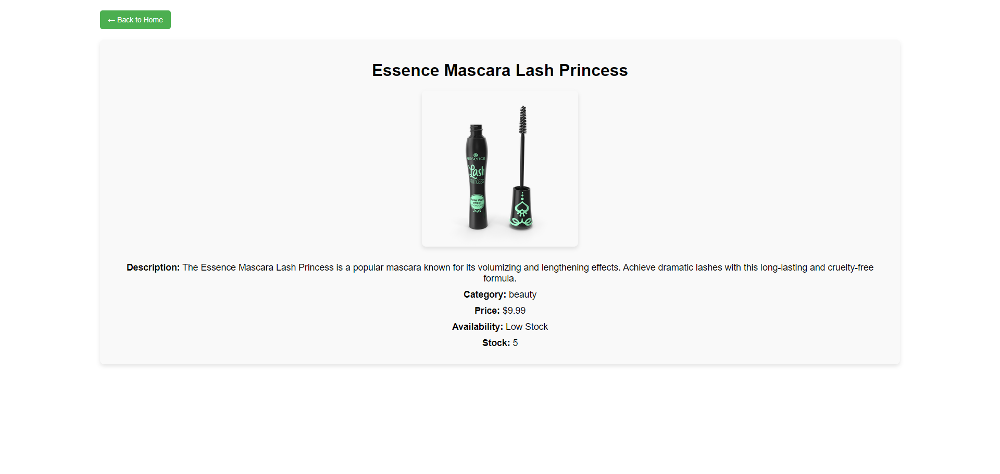

**React + TypeScript + Vite with Atomic Design and Module Federation**

This project is built using React, TypeScript, and Vite as the main tools for developing and bundling the application. It follows the Atomic Design pattern to organize components in a structured manner and incorporates Storybook to test components individually. Additionally, the project utilizes Vite Module Federation, allowing for the integration and rendering of components from remote modules.

**Key Features**

- React + TypeScript + Vite: Provides a fast, modern setup for building React applications with TypeScript support and Vite's fast refresh capabilities.

- Atomic Design: Implements the Atomic Design pattern to organize components in a scalable and maintainable manner.

- Storybook Integration: Allows developers to visually test individual components in isolation.

- Vite Module Federation: Enables the application to consume and render components from remote modules.

- Dynamic Table and Product Details: The main application consists of a table that displays product data fetched from https://dummyjson.com/products and a details page for each product, allowing users to see more information about a specific item.

**Running The Project**

In order to run the project, execute the command: 

_npm run dev_

In order to run storybook and test each component individually, execute the command:

_npm run storybook_

In order to run the project and expose its components to other remote aplicattions, first run: 

_npm run build_. 

After a successful build, run this in order to get the app in preview mode.:

_npm run preview_ 

The components you expose can be found in the _vite.config.ts_ file.

**Screenshots**

These screenshots show the main components of the application, including the table that displays product data and the detailed view for each product.

Product Table:

Product Details Page:

